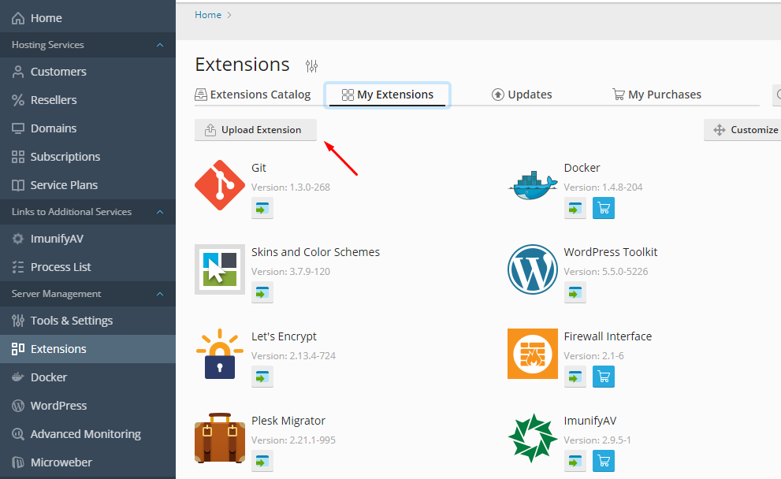
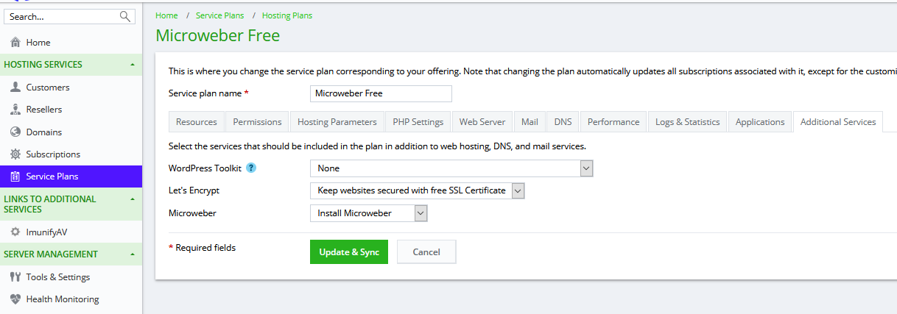
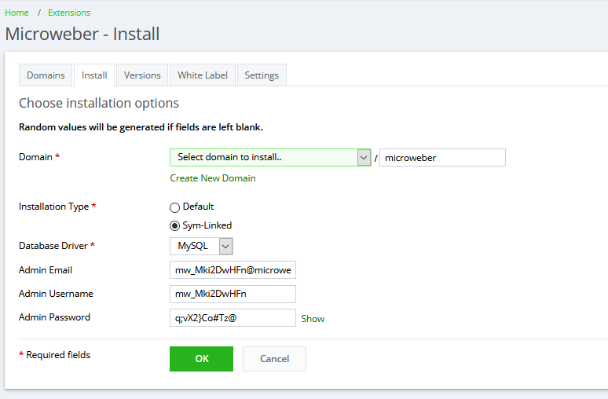
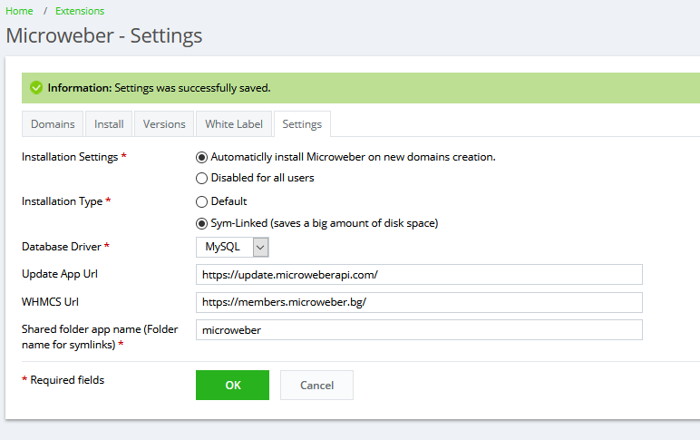
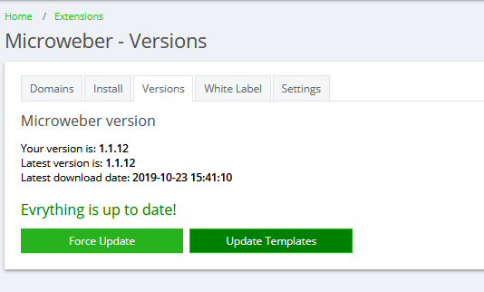

# plesk-microweber-plugin

Folders where the plugin will be installed:
```
/opt/psa/admin/sbin/modules/microweber
/usr/local/psa/admin/plib/modules/microweber
/usr/local/psa/admin/share/modules/microweber
/usr/share/microweber/latest
```

## Ho to install the plugin
1. Open Plesk Panel
2. Go to Extensions Catalog and install "Panel.ini Editor"
3. Open the Panel.ini Editor
4. Add these lines & save

```
[license]
fileUpload=true

[ext-catalog] 
extensionUpload = true

[php] 
settings.general.open_basedir.default="none"
```

### Uploading

After activation of `extensionUpload` go to Server Management > Extensions

Then upload the zip file fron the upload button

 


## How to use 


**For automatic install**: In order to make automatic install when the user creates new domain, you must go to *Home->Service Plans->Hosting Plans* and then click on *Additional Services* and select *Install Microweber* from the dropdown box. 
 
 


**For manual install**: Click the Microweber icon in the sidebar under *Server management->Microweber* and then click on *Install* and select *Domain* from the dropdown box. 
 
 


## Settings


**For plugin setup**: Go to *Server management->Microweber->Settings* and you will be able to set various options of the plugin and also connect it to WHMCS. 
 
 


## Templates download and Updates 


**For templates setup**: Go to *Server management->Microweber->Versions* and you will be able update the plugin and download templates 
 
 


##  Web server setting


If your server is slow you can improve the speed by editting some server setting

### Nginx setting 

-  open the created /etc/nginx/conf.d/directives.conf file in a text editor


```
nano /etc/nginx/conf.d/directives.conf
```

-  Add required directives. For example:
```
proxy_buffer_size          128k;
proxy_buffers              4 256k;
proxy_busy_buffers_size    256k;
```
